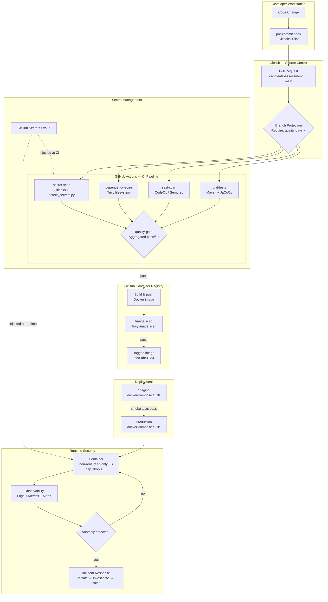
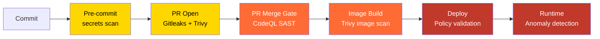

# DevSecOps Architecture Design
**Candidate:** Ismail Mallum | **Date:** 2026-07-29

---

## 1. Current State Analysis

### Repository inventory

| Component | Technology | Notes |
|---|---|---|
| Backend API | Spring Boot 3.4.3, Java 11, Maven | Serves country data via REST |
| Frontend | JavaScript / React | Consumes backend API |
| Database | H2 (in-memory) | Embedded; no persistence |
| Build tool | Maven with Maven Wrapper | `mvnw` present |
| Test coverage | JaCoCo 0.8.12 | Reports generated but not gated |
| Code style | Checkstyle 3.2.0 | Configured but gates unclear |

### Security findings in current state

| # | Finding | Severity | Detail |
|---|---|---|---|
| 1 | `spring-boot-devtools` in `runtime` scope | HIGH | DevTools enables remote restart and live-reload. It should be `optional: true` only — if it reaches the production JAR it exposes a remote code execution vector. |
| 2 | Spring Security version mismatch | HIGH | `spring-boot-starter-security` is pinned to `2.7.0` while the parent is Spring Boot `3.4.3`. This is a cross-major-version incompatibility. Spring Boot 3.x requires Security 6.x. |
| 3 | H2 console potentially exposed | MEDIUM | H2's web console is enabled by default in dev profiles. If the `default` profile reaches production with `spring.h2.console.enabled=true`, it exposes a SQL console with no authentication. |
| 4 | No CI/CD pipeline | HIGH | No automated build, test, or security scanning. Every commit goes unvalidated. |
| 5 | No container hardening | HIGH | No Dockerfile — deployment method unknown; assumed bare JAR or ad-hoc Docker run. |
| 6 | No secret management | HIGH | No evidence of a secrets manager. Credentials likely in application.properties or environment files committed to the repository. |
| 7 | Java 11 (EOL) | MEDIUM | Java 11 reached end-of-life for free community builds. The attack surface grows as unpatched CVEs accumulate. Migrate to Java 21 (LTS). |

### What is already good

- Checkstyle and JaCoCo plugins are present — the team has started thinking about quality gates.
- Maven Wrapper is committed — reproducible builds without a pre-installed Maven.
- Spring Boot 3.4.3 is a recent, well-maintained release.

---

## 2. Target DevSecOps Architecture

### Architecture overview



### Security integration points (shift-left model)



The cost of fixing a vulnerability increases by ~10x at each stage. Catching a hardcoded secret at pre-commit costs seconds. Finding it after a production breach costs incident response, credential rotation, potential regulatory notification, and reputational damage.

---

## 3. Tool Selection & Justification

### Security toolchain

| Layer | Tool chosen | Alternatives considered | Why this tool |
|---|---|---|---|
| Secret scanning (history) | **Gitleaks** | TruffleHog, detect-secrets | Native GitHub Action, scans full git history, 250+ patterns, SARIF output. TruffleHog is more comprehensive but heavier for CI. |
| Secret scanning (files) | **Custom Python engine** | detect-secrets (Yelp) | No external dependency risk; entropy scoring + false-positive filtering purpose-built for this codebase. |
| Vulnerability scanning | **Trivy** | Snyk, OWASP Dependency Check | Single binary covering OS packages, language deps, Dockerfile misconfigs, IaC. Free, no API key required. Snyk is excellent but requires a paid plan for team usage. |
| SAST (next phase) | **CodeQL** | Semgrep, SonarQube | Free for public repos, deep data-flow analysis, native GitHub integration. Semgrep is faster but shallower. |
| Container runtime | **Eclipse Temurin Alpine** | Distroless, Ubuntu | Good balance: Alpine is minimal (attack surface) but still has a shell for debugging. Distroless is more secure but harder to troubleshoot. |
| Secrets management | **GitHub Secrets** (now) → **HashiCorp Vault** (target) | AWS Secrets Manager, Azure Key Vault | GitHub Secrets is zero-friction for this assessment. Vault provides dynamic secrets, audit logs, and fine-grained access control for production. |
| IaC (target state) | **Kubernetes + Helm** | Docker Compose, Terraform | Compose is sufficient for a single-host deployment. K8s adds horizontal scaling, RBAC, network policies, and PodSecurity admission control. |

### Why not just use one scanning tool?

Defence-in-depth. No single scanner catches everything:
- Gitleaks finds secrets in commit history; Trivy finds CVEs in dependencies; CodeQL finds injection vulnerabilities in logic. Each addresses a different threat model. The marginal cost of adding a second scanner in CI is ~2 minutes; the marginal security benefit is significant.

---

## 4. Implementation Roadmap

### Phase 1 — Foundation (Week 1–2) ✅ Done in this assessment

| Task | Status |
|---|---|
| Secret Detection Engine (Block 1) | ✅ Complete |
| CI/CD pipeline with Gitleaks + Trivy (Block 2) | ✅ Complete |
| Hardened Dockerfile + docker-compose (Block 3) | ✅ Complete |

### Phase 2 — Strengthen (Week 3–4)

| Task | Priority | Effort |
|---|---|---|
| Fix Spring Security version mismatch (2.7.0 → 6.x) | CRITICAL | Low |
| Remove `spring-boot-devtools` from runtime scope | HIGH | Low |
| Add CodeQL SAST to pipeline | HIGH | Medium |
| Gate JaCoCo coverage at 80% minimum | MEDIUM | Low |
| Add Trivy image scan step (post-build) | HIGH | Low |
| Implement pre-commit hooks (Gitleaks + lint) | MEDIUM | Low |

### Phase 3 — Harden (Month 2)

| Task | Priority | Effort |
|---|---|---|
| Migrate from H2 to PostgreSQL with connection pooling | HIGH | Medium |
| Integrate HashiCorp Vault for secret management | HIGH | High |
| Add Spring Boot Actuator with secured endpoints | MEDIUM | Low |
| Implement structured logging (JSON) for SIEM ingestion | MEDIUM | Medium |
| Migrate Java 11 → Java 21 (LTS) | MEDIUM | Medium |
| Add DAST scan (OWASP ZAP) in staging pipeline | MEDIUM | High |

### Phase 4 — Scale (Month 3+)

| Task | Priority | Effort |
|---|---|---|
| Migrate Docker Compose → Kubernetes | MEDIUM | High |
| Implement Kubernetes Network Policies | HIGH | Medium |
| Add PodSecurity admission controller | HIGH | Medium |
| Runtime threat detection (Falco) | MEDIUM | High |
| Centralised observability stack (Prometheus + Grafana + Loki) | MEDIUM | High |
| Software Bill of Materials (SBOM) generation per release | MEDIUM | Low |

---

## 5. Scalability & Cost Considerations

### Scalability

The current single-host Docker Compose deployment has a hard ceiling. The migration path is:

```
Docker Compose (1 host)
    → Docker Swarm (multi-host, low ops overhead)
        → Kubernetes (full orchestration, horizontal autoscaling, rolling deploys)
```

Kubernetes enables:
- **Horizontal Pod Autoscaling** — scale `country-service` replicas based on CPU/RPS
- **Network Policies** — zero-trust networking between pods
- **PodSecurity Standards** — enforce `restricted` profile (equivalent to our Compose hardening, applied cluster-wide)
- **RBAC** — fine-grained access control to the API server

### Cost vs. complexity trade-offs

| Approach | Cost | Complexity | When appropriate |
|---|---|---|---|
| Docker Compose + GitHub Actions | $ | Low | Single team, ≤ 2 services, early stage |
| K8s (managed: EKS/GKE/AKS) | $$$ | High | Multiple services, scaling requirements, strict compliance |
| Vault (self-hosted) | $$ | High | Production secrets management, audit requirements |
| GitHub Secrets | $ | None | Development, small teams, public repos |

**Recommendation for this team now:** Stay on Docker Compose + GitHub Actions. Introduce Vault when the team grows beyond 3 developers or when a compliance framework (SOC 2, ISO 27001) requires an audit trail of secret access.

---

## 6. Team Workflow Optimisation

### Proposed git workflow

```
main (protected)
  └── candidate-assessment / feature branches
        → PR required to merge
        → quality-gate job must pass
        → 1 reviewer approval required
```

### Developer experience principles

1. **Fast feedback** — secret scan and lint run in < 2 minutes. SAST and Trivy run in parallel. Developers should not wait > 5 minutes for initial feedback.
2. **Clear failure messages** — the `quality-gate` job prints exactly which scanner failed and what remediation action to take. No hunting through logs.
3. **No bypass** — branch protection rules must require `quality-gate` to pass. `--force` pushes to main are disabled. These are not optional.
4. **Low false-positive rate** — high false-positive rates cause developers to ignore alerts (alert fatigue). Tune `--ignore-unfixed` on Trivy and entropy thresholds on the custom scanner to keep the signal-to-noise ratio high.
